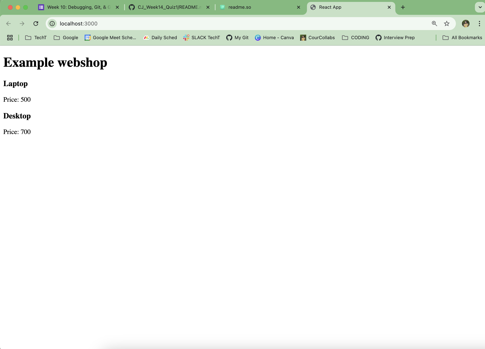

## Week 14 Quiz - Debugging, Git, & GitHub

You have just joined your favorite company and have been tasked with printing new data to a webpage. However, the existing files/directories are all jumbled up, and the code seems to have errors. Fix the bugs and sile structure. 

1. Debug the broken code so that it's working
- I ran the code below to fix any outdated dependencies:

```bash
npm i -y 
npm audit fix --force
```

- I ran both the client and server with this command to view your webpage:
```bash
npm start
```

- Errors found was that the name of the item and the numerical prices were not displaying. I only saw "Price: "
- I found within the app.js file the renderItems function was returning "items.name" and "items.price"
- Then corrected the syntax to "item.name" and "item.price"
- The correct webpage should display the following data below:



2. Correct the file architecture using command line
- I moved your server file folder to the same root level as client (outside of client) using the commands below:
```bash
mv client/server .
```
3. node_modules are committed, remove them from repo on GitHub
- I was able to add your node_modules in both your server and client files by adding them to your .gitignore file on lines 19 (client) and 17 (server). The command line command you would use is:

```bash
echo "node_modules" >> .gitignore
```

4. Correct the server file’s directory by moving it to the appropriate directory
- This was corrected when I moved the server folder out of the client folder.

5. Update README with
    - screenshot of the app's webpage: 

    - document errors you encountered and how you fixed them, 
    - detail the git commands you used to remove the node_modules, and
    - detail the git commands you used to correct the file structure